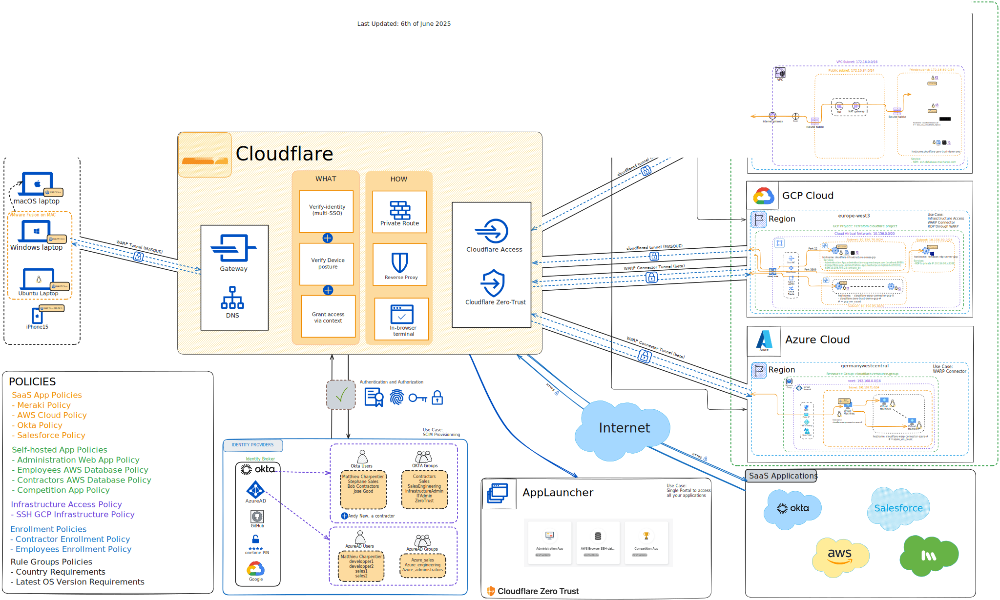
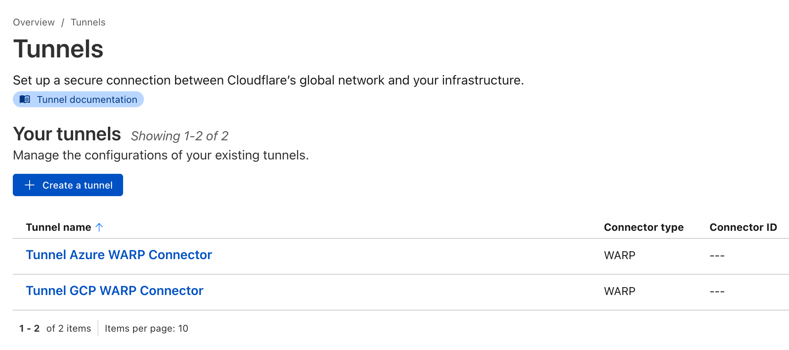
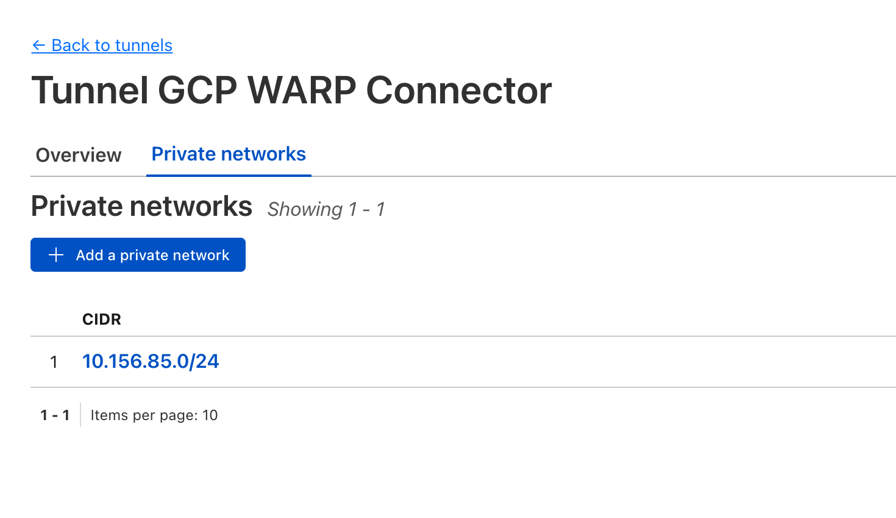
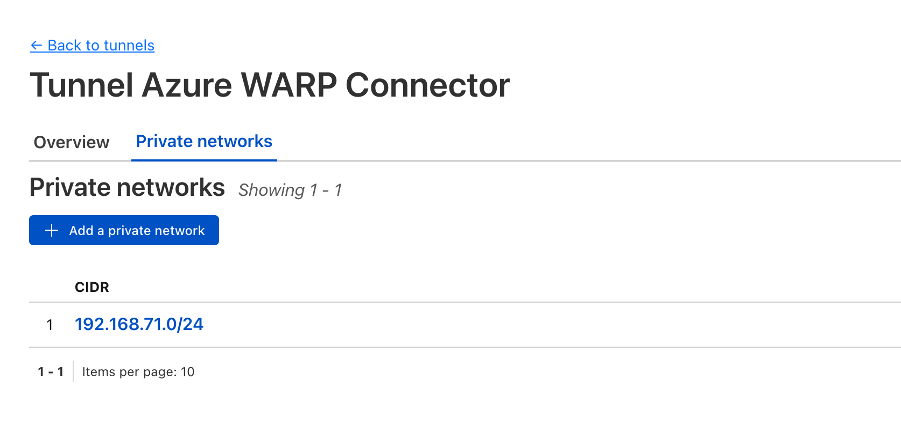
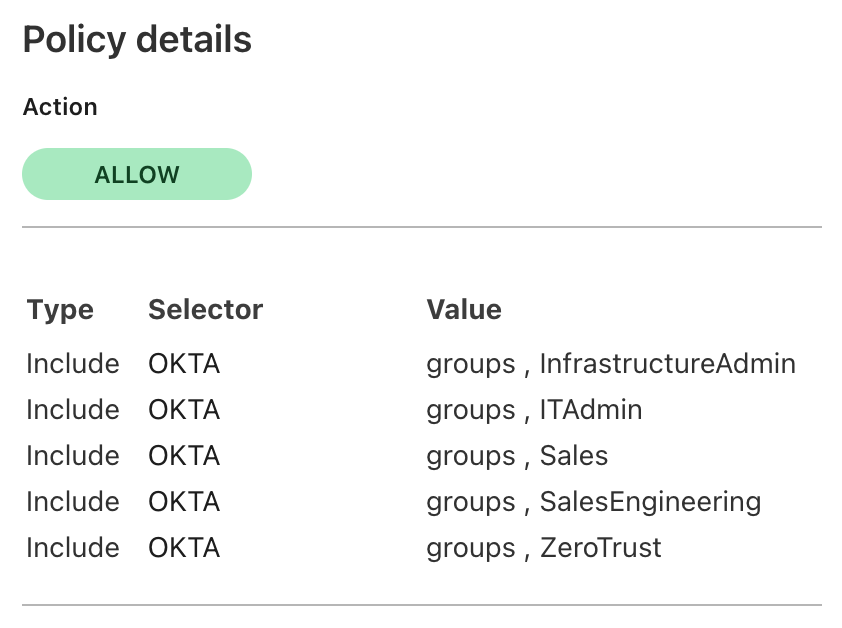
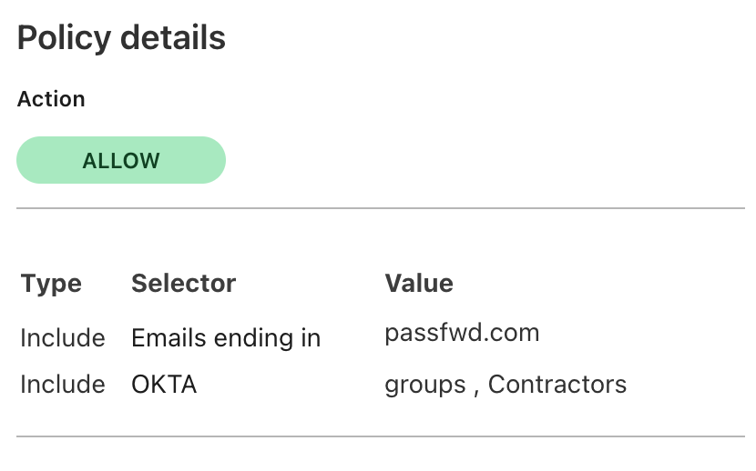
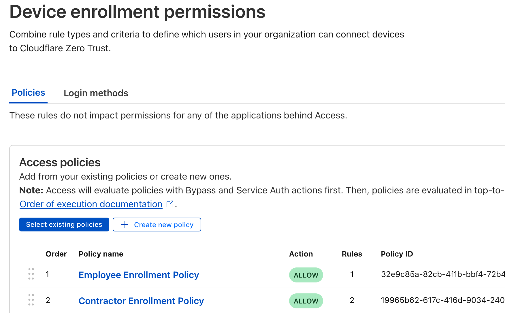
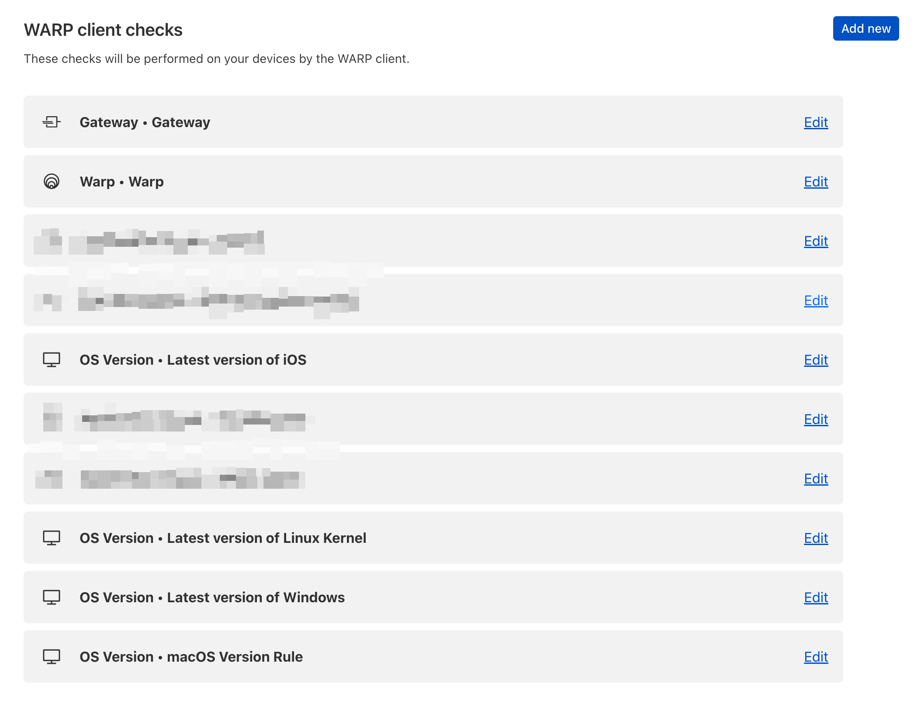

# Disclaimer

This is a work in progress 🚧 and therefore no everything is perfect but I intend to maintain it and improve it along the way.

## Architecture

This is the diagram showing at a high-level the architecture and the components involved (and how they are connected together)

_Last Updated: 6th of June 2025_

## Introduction

I have published 3 blogs posts summarizing the goal of this and how it can be used (also what is unique about it). Feel free to check it out for more context.
- Part 1: [Building a Scalable Zero Trust Demo environment with Cloudflare and Terraform (Part 1)](https://www.linkedin.com/pulse/building-scalable-zero-trust-demo-environment-part-1-charpentier-ntgoe/?trackingId=bl5ST2%2FDTgW7ueBjhaW0hw%3D%3D)
- Part 2: [Automating Cloudflare Zero Trust at Scale: Terraform, Multi-Cloud, and Identity (Part 2)](https://www.linkedin.com/pulse/automating-cloudflare-zero-trust-scale-terraform-part-charpentier-ova1e/)
- Part 3: [Zero Trust for Real-World Scenarios: Use Cases and Extensions (Part 3 - Final)](https://www.linkedin.com/pulse/zero-trust-real-world-scenarios-use-cases-extensions-part-matthieu-t5qee/)

## Prerequisites

These are some of the steps you will need to perform before running the Terraform script.

### Integration with other accounts

For this demo to work, you will need to have the following accounts created:

- Cloudflare Account
- Okta Dev Account
- Azure Account
- AWS Account
- GCP Account
- A registered domain with Cloudflare
- Meraki Account
- Salesforce Account
- Datadog Account

### WARP Connector setup in Cloudflare UI

Because, the Cloudflare Terraform provider does not support the creation and management of a "warp connector" ressource in Cloudflare, you need to manually create them in the UI

Under Networks > Tunnels > Create tunnel (select Warp Connector not cloudflared) Create two tunnels like depicted below

Then you need to attach "Private Routes" to these WARP Connector Tunnels so that the respective networks are routed through the appropriate tunnels
- For "Tunnel Azure WARP Connector", the network should be corresponding to the Terraform variable called **azure_address_prefixes** (in my case, 192.168.71.0/24)
- For "Tunnel GCP WARP Connector", the network should be corresponding to the Terraform variable called **gcp_ip_cidr_warp**  (in my case, 10.156.85.0/24)

Finally, you will need to retrive the tunnel IDs and store them in the following Terraform variables **cf_tunnel_warp_connector_azure_id** and **cf_tunnel_warp_connector_gcp_id** respectively.

### Device enrollment Policies permissions in Cloudflare UI

Create two policies:
- Employee Enrollment Policy
- Contractor Enrollment Policy

Employee Enrollment Policy: allowing anyone part of any Okta group to enroll their device  

Contractors Enrollment Policy: allowing contractros with email domain = @passfwd OR part of Okta Group "Contractors" 

This is what your Device Enrollment Permissions should look like: 

### WARP Client checks

### Policy assignment

1. *After* you have created all the ressources with Terraform, the policies for the "SaaS" type App in Cloudflare need to be assigned manually (Okta, Meraki, etc...)
2. *Before* you destroy everything, the policies assigned manually to the "SaaS" type App in Cloudflare need to be removed manually (Okta, Meraki, etc...)

### Summary of the connectivity you can expect

| Host | Cloud Provider | ping Status | Notes |
|------|----------------|---------|-------|
| cloudflared-replica-aws-0 | AWS | ❌ **FAIL** | Cloudflared tunnel endpoint |
| cloudflare-zero-trust-demo-aws | AWS | ❌ **FAIL** | Demo instance |
| cloudflare-warp-connector-azure-0 | Azure | ❌ **FAIL** | WARP Connector |
| cloudflare-zero-trust-demo-azure-1 | Azure | ✅ **SUCCESS** | Demo instance |
| cloudflare-infrastructure-access-gcp | GCP | ✅ **SUCCESS** | Infrastructure access |
| cloudflare-warp-connector-gcp-0 | GCP | ❌ **FAIL** | WARP Connector |
| cloudflare-zero-trust-demo-gcp-1 | GCP | ✅ **SUCCESS** | Demo instance |
| windows-rdp-server-gcp | GCP | ✅ **SUCCESS** | Windows RDP server |

_NB: I am working on resolving the ping failing between the client and AWS workload. It should be working._

## Roadmap
- Use the Entra ID integration
- Use case for WARP Connector (Site-to-Site, Site-to-Internet...) [documentation](https://developers.cloudflare.com/cloudflare-one/connections/connect-networks/private-net/warp-connector/)
- SaaS Application in Cloudflare Access managed by Terraform
- Observability use case with Datadog

## Terraform.tfvars

All the variables needed are listed in the file called **terraform.tfvars.example** that you can rename **terraform.tfvars** after you have filled in the blancks.

## Initialisation and Apply

<pre>
git clone https://github.com/macharpe/terraform-cloudflare-zero-trust-demo
cp terraform.tfvars.example terraform.tfvars</pre>

### Manually retrieved

All the variables with "\# Manually retrieved" tag before will need to be retrieved manually. This is due to the fact that I also use some of these accounts for personnal use and I don't want to destroy everything as part of the **terraform destroy** command.

Here is the list:

<pre>
# Manually retrieved
cf_gateway_posture_id                     = "oject_id_in_cloudflare_for_gateway_presence"
cf_latest_macOS_version_posture_id        = "custom_rule_checking_lastest_version_of_osx"
cf_latest_windows_version_posture_id      = "custom_rule_checking_lastest_version_of_windows"
cf_latest_linux_kernel_version_posture_id = "custom_rule_checking_lastest_version_of_linux"
cf_okta_identity_provider_id              = "object_id_okta_identity_provider_in_cloudflare"
cf_onetimepin_identity_provider_id        = "object_id_onetimePIN_identity_provider_in_cloudflare"
cf_azure_identity_provider_id             = "object_id_azureAD_identity_provider_in_cloudflare"
cf_azure_administrators_rule_group_id     = "custom_rule_group_in_cloudflare_pointing_to_azure_administrators_group_custom"

# Okta groups
# Manually retrieved
okta_zerotrust_group_id           = "group_id_zerotrust_group_in_okta"
okta_contractors_group_id         = "group_id_contractors_group_in_okta"
okta_infrastructureadmin_group_id = "group_id_infrastructureadmin_group_in_okta"
okta_itadmin_group_id             = "group_id_itadmin_group_in_okta"
okta_salesengineering_group_id    = "group_id_salesengineering_group_in_okta"
okta_sales_group_id               = "group_id_sales_group_in_okta"
okta_meraki_group_id              = "group_id_meraki_group_in_okta"

# Okta users
# Manually retrieved
okta_matthieu_user_id = "user_id_matthieu_in_okta"
okta_jose_user_id     = "user_id_jose_in_okta"
okta_stephane_user_id = "user_id_stephane_in_okta"

# Manually retrieved
azure_matthieu_user_object_id = "custome_user_matthieu_azuread_in_AzureAD"
cf_osx_version_posture_rule_id = ""

#Manually retrieved
cf_tunnel_warp_connector_azure_id = "185f0bc0-986d-46c............."
cf_tunnel_warp_connector_gcp_id   = "ad04a3ed-a1a1-460........"</pre>

## Environment variables

You will need to have environment variables defined. Here is the list that I have setup in a .envrc file at the root

<pre># Terraform Zero Trust Project
# Cloudflare
export TF_VAR_cloudflare_api_key=""
export TF_VAR_cloudflare_account_id=""
export TF_VAR_cloudflare_email=""
export TF_VAR_cloudflare_zone_id=""

# AWS
export AWS_ACCESS_KEY_ID=""
export AWS_SECRET_ACCESS_KEY=""

# Azure
export TF_VAR_azure_tenant_id=""
export TF_VAR_azure_subscription_id=""

# Google
export GOOGLE_APPLICATION_CREDENTIALS="path_to_your_json_file"
export TF_VAR_gcp_project_id=""

# Datadog
export TF_VAR_datadog_api_key=""</pre>

<!-- BEGIN_TF_DOCS -->
## Requirements

| Name | Version |
|------|---------|
|  [terraform](#requirement\_terraform) | >= 1.11.0 |
|  [aws](#requirement\_aws) | ~> 5.0 |
|  [azuread](#requirement\_azuread) | ~> 3.4 |
|  [azurerm](#requirement\_azurerm) | ~> 4.0 |
|  [cloudflare](#requirement\_cloudflare) | ~> 5.5.0 |
|  [google](#requirement\_google) | ~> 6.0 |

## Providers

| Name | Version |
|------|---------|
|  [aws](#provider\_aws) | ~> 5.0 |
|  [azurerm](#provider\_azurerm) | ~> 4.0 |
|  [google](#provider\_google) | ~> 6.0 |
|  [http](#provider\_http) | n/a |

## Modules

| Name | Source | Version |
|------|--------|---------|
|  [azure-ad](#module\_azure-ad) | ./modules/azure | n/a |
|  [cloudflare](#module\_cloudflare) | ./modules/cloudflare | n/a |
|  [ssh\_keys](#module\_ssh\_keys) | ./modules/keys | n/a |
|  [warp-routing](#module\_warp-routing) | ./modules/warp-routing | n/a |

## Resources

| Name | Type |
|------|------|
| [aws_eip.nat_eip](https://registry.terraform.io/providers/hashicorp/aws/latest/docs/resources/eip) | resource |
| [aws_iam_instance_profile.ec2_profile](https://registry.terraform.io/providers/hashicorp/aws/latest/docs/resources/iam_instance_profile) | resource |
| [aws_iam_role.ec2_ssm_role](https://registry.terraform.io/providers/hashicorp/aws/latest/docs/resources/iam_role) | resource |
| [aws_iam_role_policy.ec2_ssm_policy](https://registry.terraform.io/providers/hashicorp/aws/latest/docs/resources/iam_role_policy) | resource |
| [aws_instance.aws_ec2_service_instance](https://registry.terraform.io/providers/hashicorp/aws/latest/docs/resources/instance) | resource |
| [aws_instance.cloudflared_aws](https://registry.terraform.io/providers/hashicorp/aws/latest/docs/resources/instance) | resource |
| [aws_internet_gateway.igw](https://registry.terraform.io/providers/hashicorp/aws/latest/docs/resources/internet_gateway) | resource |
| [aws_key_pair.aws_ec2_cloudflared_key_pair](https://registry.terraform.io/providers/hashicorp/aws/latest/docs/resources/key_pair) | resource |
| [aws_key_pair.aws_ec2_service_key_pair](https://registry.terraform.io/providers/hashicorp/aws/latest/docs/resources/key_pair) | resource |
| [aws_nat_gateway.nat](https://registry.terraform.io/providers/hashicorp/aws/latest/docs/resources/nat_gateway) | resource |
| [aws_route_table.private_rt](https://registry.terraform.io/providers/hashicorp/aws/latest/docs/resources/route_table) | resource |
| [aws_route_table.public_rt](https://registry.terraform.io/providers/hashicorp/aws/latest/docs/resources/route_table) | resource |
| [aws_route_table_association.private](https://registry.terraform.io/providers/hashicorp/aws/latest/docs/resources/route_table_association) | resource |
| [aws_route_table_association.public](https://registry.terraform.io/providers/hashicorp/aws/latest/docs/resources/route_table_association) | resource |
| [aws_security_group.aws_cloudflared_sg](https://registry.terraform.io/providers/hashicorp/aws/latest/docs/resources/security_group) | resource |
| [aws_security_group.aws_ssh_server_sg](https://registry.terraform.io/providers/hashicorp/aws/latest/docs/resources/security_group) | resource |
| [aws_ssm_parameter.aws_cloudflare_tunnel_secret](https://registry.terraform.io/providers/hashicorp/aws/latest/docs/resources/ssm_parameter) | resource |
| [aws_ssm_parameter.datadog_api_key](https://registry.terraform.io/providers/hashicorp/aws/latest/docs/resources/ssm_parameter) | resource |
| [aws_subnet.aws_private_subnet](https://registry.terraform.io/providers/hashicorp/aws/latest/docs/resources/subnet) | resource |
| [aws_subnet.aws_public_subnet](https://registry.terraform.io/providers/hashicorp/aws/latest/docs/resources/subnet) | resource |
| [aws_vpc.aws_custom_vpc](https://registry.terraform.io/providers/hashicorp/aws/latest/docs/resources/vpc) | resource |
| [azurerm_linux_virtual_machine.cloudflare_zero_trust_demo_azure](https://registry.terraform.io/providers/hashicorp/azurerm/latest/docs/resources/linux_virtual_machine) | resource |
| [azurerm_nat_gateway.cloudflare_natgw](https://registry.terraform.io/providers/hashicorp/azurerm/latest/docs/resources/nat_gateway) | resource |
| [azurerm_nat_gateway_public_ip_association.natgw_ip](https://registry.terraform.io/providers/hashicorp/azurerm/latest/docs/resources/nat_gateway_public_ip_association) | resource |
| [azurerm_network_interface.nic](https://registry.terraform.io/providers/hashicorp/azurerm/latest/docs/resources/network_interface) | resource |
| [azurerm_network_interface_security_group_association.main](https://registry.terraform.io/providers/hashicorp/azurerm/latest/docs/resources/network_interface_security_group_association) | resource |
| [azurerm_network_security_group.nsg](https://registry.terraform.io/providers/hashicorp/azurerm/latest/docs/resources/network_security_group) | resource |
| [azurerm_public_ip.nat_gateway_public_ip](https://registry.terraform.io/providers/hashicorp/azurerm/latest/docs/resources/public_ip) | resource |
| [azurerm_public_ip.public_ip](https://registry.terraform.io/providers/hashicorp/azurerm/latest/docs/resources/public_ip) | resource |
| [azurerm_resource_group.cloudflare_rg](https://registry.terraform.io/providers/hashicorp/azurerm/latest/docs/resources/resource_group) | resource |
| [azurerm_route_table.cloudflare_route_table_warp](https://registry.terraform.io/providers/hashicorp/azurerm/latest/docs/resources/route_table) | resource |
| [azurerm_subnet.cloudflare_subnet](https://registry.terraform.io/providers/hashicorp/azurerm/latest/docs/resources/subnet) | resource |
| [azurerm_subnet_nat_gateway_association.cloudflare_natgw_association](https://registry.terraform.io/providers/hashicorp/azurerm/latest/docs/resources/subnet_nat_gateway_association) | resource |
| [azurerm_subnet_route_table_association.cloudflare_subnet_route_association](https://registry.terraform.io/providers/hashicorp/azurerm/latest/docs/resources/subnet_route_table_association) | resource |
| [azurerm_virtual_network.cloudflare_vnet](https://registry.terraform.io/providers/hashicorp/azurerm/latest/docs/resources/virtual_network) | resource |
| [google_compute_address.cloud_nat_ip](https://registry.terraform.io/providers/hashicorp/google/latest/docs/resources/compute_address) | resource |
| [google_compute_firewall.allow_egress](https://registry.terraform.io/providers/hashicorp/google/latest/docs/resources/compute_firewall) | resource |
| [google_compute_firewall.allow_icmp_from_any](https://registry.terraform.io/providers/hashicorp/google/latest/docs/resources/compute_firewall) | resource |
| [google_compute_firewall.allow_rdp_from_my-ip](https://registry.terraform.io/providers/hashicorp/google/latest/docs/resources/compute_firewall) | resource |
| [google_compute_firewall.allow_ssh_from_my_ip](https://registry.terraform.io/providers/hashicorp/google/latest/docs/resources/compute_firewall) | resource |
| [google_compute_firewall.default_ssh_deny](https://registry.terraform.io/providers/hashicorp/google/latest/docs/resources/compute_firewall) | resource |
| [google_compute_firewall.deny_egress_ssh](https://registry.terraform.io/providers/hashicorp/google/latest/docs/resources/compute_firewall) | resource |
| [google_compute_instance.gcp_cloudflared_vm_instance](https://registry.terraform.io/providers/hashicorp/google/latest/docs/resources/compute_instance) | resource |
| [google_compute_instance.gcp_vm_instance](https://registry.terraform.io/providers/hashicorp/google/latest/docs/resources/compute_instance) | resource |
| [google_compute_instance.gcp_windows_rdp_server](https://registry.terraform.io/providers/hashicorp/google/latest/docs/resources/compute_instance) | resource |
| [google_compute_network.gcp_custom_vpc](https://registry.terraform.io/providers/hashicorp/google/latest/docs/resources/compute_network) | resource |
| [google_compute_route.default_route](https://registry.terraform.io/providers/hashicorp/google/latest/docs/resources/compute_route) | resource |
| [google_compute_route.route_to_aws_subnet](https://registry.terraform.io/providers/hashicorp/google/latest/docs/resources/compute_route) | resource |
| [google_compute_route.route_to_azure_subnet](https://registry.terraform.io/providers/hashicorp/google/latest/docs/resources/compute_route) | resource |
| [google_compute_route.route_to_warp_subnet](https://registry.terraform.io/providers/hashicorp/google/latest/docs/resources/compute_route) | resource |
| [google_compute_router.cloud_router](https://registry.terraform.io/providers/hashicorp/google/latest/docs/resources/compute_router) | resource |
| [google_compute_router_nat.cloud_nat](https://registry.terraform.io/providers/hashicorp/google/latest/docs/resources/compute_router_nat) | resource |
| [google_compute_subnetwork.gcp_cloudflared_subnet](https://registry.terraform.io/providers/hashicorp/google/latest/docs/resources/compute_subnetwork) | resource |
| [google_compute_subnetwork.gcp_cloudflared_windows_rdp_subnet](https://registry.terraform.io/providers/hashicorp/google/latest/docs/resources/compute_subnetwork) | resource |
| [google_compute_subnetwork.gcp_warp_subnet](https://registry.terraform.io/providers/hashicorp/google/latest/docs/resources/compute_subnetwork) | resource |
| [http_http.my_ip](https://registry.terraform.io/providers/hashicorp/http/latest/docs/data-sources/http) | data source |

## Inputs

| Name | Description | Type | Default | Required |
|------|-------------|------|---------|:--------:|
|  [aws\_ec2\_cloudflared\_name](#input\_aws\_ec2\_cloudflared\_name) | name of cloudflared replica | `string` | n/a | yes |
|  [aws\_ec2\_cloudflared\_replica\_count](#input\_aws\_ec2\_cloudflared\_replica\_count) | number of cloudflared replicas | `number` | `1` | no |
|  [aws\_ec2\_instance\_config\_ami\_id](#input\_aws\_ec2\_instance\_config\_ami\_id) | AMI ID representing the VM type and ID to be used | `string` | `"ami-086ecbd485d8bb032"` | no |
|  [aws\_ec2\_instance\_config\_type](#input\_aws\_ec2\_instance\_config\_type) | type of EC2 instance | `string` | `"t3.micro"` | no |
|  [aws\_ec2\_instsance\_name](#input\_aws\_ec2\_instsance\_name) | Name of the EC2 instance | `string` | n/a | yes |
|  [aws\_private\_subnet\_cidr](#input\_aws\_private\_subnet\_cidr) | AWS private subnet, subnet for VMs in AWS | `string` | n/a | yes |
|  [aws\_public\_subnet\_cidr](#input\_aws\_public\_subnet\_cidr) | AWS public subnet | `string` | n/a | yes |
|  [aws\_region](#input\_aws\_region) | AWS region | `string` | `"eu-central-1"` | no |
|  [aws\_users](#input\_aws\_users) | List of all the AWS users | `list(string)` | n/a | yes |
|  [aws\_vm\_default\_user](#input\_aws\_vm\_default\_user) | default user for AWS VM | `string` | n/a | yes |
|  [aws\_vpc\_cidr](#input\_aws\_vpc\_cidr) | AWS vpc cidr, subnet for vpc in AWS | `string` | n/a | yes |
|  [azure\_address\_prefixes](#input\_azure\_address\_prefixes) | Azure address prefix, subnet for VM in Azure | `string` | n/a | yes |
|  [azure\_address\_vnet](#input\_azure\_address\_vnet) | Azure address vnet, subnet for vnet in Azure | `string` | n/a | yes |
|  [azure\_default\_tags](#input\_azure\_default\_tags) | default tags for Azure | `map(string)` | <pre>{   "Owner": "macharpe",   "environment": "dev",   "service": "cloudflare-zero-trust-demo" }</pre> | no |
|  [azure\_developer1\_name](#input\_azure\_developer1\_name) | User 1 in Azure AD | `string` | n/a | yes |
|  [azure\_developer2\_name](#input\_azure\_developer2\_name) | User 1 in Azure AD | `string` | n/a | yes |
|  [azure\_matthieu\_user\_object\_id](#input\_azure\_matthieu\_user\_object\_id) | Object ID in Azure for user Matthieu | `string` | n/a | yes |
|  [azure\_public\_dns\_domain](#input\_azure\_public\_dns\_domain) | Azure Public DNS Domain | `string` | n/a | yes |
|  [azure\_resource\_group\_location](#input\_azure\_resource\_group\_location) | Location for all resources | `string` | `"Germany West Central"` | no |
|  [azure\_resource\_group\_name](#input\_azure\_resource\_group\_name) | Ressource Group Name | `string` | n/a | yes |
|  [azure\_sales1\_name](#input\_azure\_sales1\_name) | User 1 in Azure AD | `string` | n/a | yes |
|  [azure\_sales2\_name](#input\_azure\_sales2\_name) | User 1 in Azure AD | `string` | n/a | yes |
|  [azure\_subscription\_id](#input\_azure\_subscription\_id) | Azure Subscription ID | `string` | n/a | yes |
|  [azure\_user\_password](#input\_azure\_user\_password) | Password for Azure AD users | `string` | n/a | yes |
|  [azure\_user\_principal\_domain](#input\_azure\_user\_principal\_domain) | Domain for users created in Azure AD | `string` | n/a | yes |
|  [azure\_vm\_admin\_password](#input\_azure\_vm\_admin\_password) | Administrator password (min 12 characters) | `string` | n/a | yes |
|  [azure\_vm\_admin\_username](#input\_azure\_vm\_admin\_username) | Administrator username | `string` | n/a | yes |
|  [azure\_vm\_count](#input\_azure\_vm\_count) | number of Azure VM | `number` | `1` | no |
|  [azure\_vm\_name](#input\_azure\_vm\_name) | Azure VM name where WARP Connector is NOT installed | `string` | n/a | yes |
|  [azure\_vm\_size](#input\_azure\_vm\_size) | Azure VM size | `string` | `"Standard_B1ls"` | no |
|  [azure\_warp\_connector\_vm\_name](#input\_azure\_warp\_connector\_vm\_name) | Name of the Azure VM where WARP Connector is installed | `string` | n/a | yes |
|  [cf\_administration\_web\_app\_name](#input\_cf\_administration\_web\_app\_name) | Name of the Administration web App in Cloudflare | `string` | n/a | yes |
|  [cf\_administration\_web\_app\_port](#input\_cf\_administration\_web\_app\_port) | Name of the Sensitive web App in Cloudflare | `number` | n/a | yes |
|  [cf\_aws\_tag](#input\_cf\_aws\_tag) | tag to be assigned to cloudflare application and aws environment | `string` | n/a | yes |
|  [cf\_azure\_administrators\_rule\_group\_id](#input\_cf\_azure\_administrators\_rule\_group\_id) | Azure Administrators Rule Group ID in Cloudflare | `string` | n/a | yes |
|  [cf\_azure\_identity\_provider\_id](#input\_cf\_azure\_identity\_provider\_id) | Azure Entra ID identity provider ID in Cloudflare | `string` | n/a | yes |
|  [cf\_browser\_rendering\_app\_name](#input\_cf\_browser\_rendering\_app\_name) | Name of the Browser Rendering App in Cloudflare | `string` | n/a | yes |
|  [cf\_custom\_cgnat\_routes](#input\_cf\_custom\_cgnat\_routes) | List of custom CGNAT routes to add to the device profile | <pre>list(object({     address     = string     description = string   }))</pre> | n/a | yes |
|  [cf\_default\_cgnat\_routes](#input\_cf\_default\_cgnat\_routes) | default cgnat routes | <pre>list(object({     address     = string     description = string   }))</pre> | <pre>[   {     "address": "100.64.0.0/10",     "description": "Default CGNAT Range"   } ]</pre> | no |
|  [cf\_default\_fallback\_domains](#input\_cf\_default\_fallback\_domains) | n/a | <pre>list(object({     suffix      = string     dns_server  = list(string)     description = string   }))</pre> | n/a | yes |
|  [cf\_device\_os](#input\_cf\_device\_os) | This is the OS you are running on your own client machine | `string` | n/a | yes |
|  [cf\_domain\_controller\_rdp\_port](#input\_cf\_domain\_controller\_rdp\_port) | Port for the Administration web App in Cloudflare | `number` | n/a | yes |
|  [cf\_email\_domain](#input\_cf\_email\_domain) | Email Domain used for email authentication in App policies | `string` | n/a | yes |
|  [cf\_gateway\_posture\_id](#input\_cf\_gateway\_posture\_id) | Gateway posture ID in Cloudflare | `string` | n/a | yes |
|  [cf\_infra\_app\_name](#input\_cf\_infra\_app\_name) | Name of the Infrastructure App in Cloudflare | `string` | n/a | yes |
|  [cf\_latest\_linux\_kernel\_version\_posture\_id](#input\_cf\_latest\_linux\_kernel\_version\_posture\_id) | Latest Linux Kernel version posture ID in Cloudflare | `string` | n/a | yes |
|  [cf\_latest\_macOS\_version\_posture\_id](#input\_cf\_latest\_macOS\_version\_posture\_id) | Latest macOS version posture ID in Cloudflare | `string` | n/a | yes |
|  [cf\_latest\_windows\_version\_posture\_id](#input\_cf\_latest\_windows\_version\_posture\_id) | Latest Windows version posture ID in Cloudflare | `string` | n/a | yes |
|  [cf\_okta\_identity\_provider\_id](#input\_cf\_okta\_identity\_provider\_id) | Okta Identity Provider ID in Cloudflare | `string` | n/a | yes |
|  [cf\_onetimepin\_identity\_provider\_id](#input\_cf\_onetimepin\_identity\_provider\_id) | OneTime PIN identity provider ID in Cloudflare | `string` | n/a | yes |
|  [cf\_osx\_version\_posture\_rule\_id](#input\_cf\_osx\_version\_posture\_rule\_id) | Rule ID for the posture check on latest version of macos | `string` | n/a | yes |
|  [cf\_sensitive\_web\_app\_name](#input\_cf\_sensitive\_web\_app\_name) | Name of the Sensitive web App in Cloudflare | `string` | n/a | yes |
|  [cf\_sensitive\_web\_app\_port](#input\_cf\_sensitive\_web\_app\_port) | Port for the Administration web App in Cloudflare | `number` | n/a | yes |
|  [cf\_subdomain\_ssh](#input\_cf\_subdomain\_ssh) | Name of the subdomain for ssh public hostname of tunnel | `string` | n/a | yes |
|  [cf\_subdomain\_web](#input\_cf\_subdomain\_web) | Name of the subdomain for web public hostname of tunnel | `string` | n/a | yes |
|  [cf\_subdomain\_web\_sensitive](#input\_cf\_subdomain\_web\_sensitive) | Name of the subdomain for web sensitive public hostname of tunnel | `string` | n/a | yes |
|  [cf\_target\_name](#input\_cf\_target\_name) | Friendly name for the Target hostname in Infrastructure App | `string` | n/a | yes |
|  [cf\_team\_name](#input\_cf\_team\_name) | Name of the Team in Cloudflare, essentially zero-trust org name | `string` | n/a | yes |
|  [cf\_tunnel\_name\_aws](#input\_cf\_tunnel\_name\_aws) | Name of the Cloudflare tunnel to AWS | `string` | n/a | yes |
|  [cf\_tunnel\_name\_gcp](#input\_cf\_tunnel\_name\_gcp) | Name of the Cloudflare tunnel to GCP | `string` | n/a | yes |
|  [cf\_tunnel\_warp\_connector\_azure\_id](#input\_cf\_tunnel\_warp\_connector\_azure\_id) | ID of the WARP Connector Tunnel manually created for Azure in UI | `string` | n/a | yes |
|  [cf\_tunnel\_warp\_connector\_gcp\_id](#input\_cf\_tunnel\_warp\_connector\_gcp\_id) | ID of the WARP Connector Tunnel manually created for GCP in UI | `string` | n/a | yes |
|  [cf\_warp\_cgnat\_cidr](#input\_cf\_warp\_cgnat\_cidr) | default ip range for WARP when overriding local interface IP | `string` | n/a | yes |
|  [cf\_windows\_rdp\_tunnel\_name\_gcp](#input\_cf\_windows\_rdp\_tunnel\_name\_gcp) | Name of the Cloudflared tunnel for Windows RDP Server GCP | `string` | n/a | yes |
|  [cloudflare\_account\_id](#input\_cloudflare\_account\_id) | Cloudflare account ID | `string` | n/a | yes |
|  [cloudflare\_api\_key](#input\_cloudflare\_api\_key) | Cloudflare API key | `string` | n/a | yes |
|  [cloudflare\_email](#input\_cloudflare\_email) | Cloudflare login email | `string` | n/a | yes |
|  [cloudflare\_zone\_id](#input\_cloudflare\_zone\_id) | Cloudflare zone ID | `string` | n/a | yes |
|  [datadog\_api\_key](#input\_datadog\_api\_key) | Datadog API Key from https://app.datadoghq.com/organization-settings/api-keys | `string` | n/a | yes |
|  [datadog\_region](#input\_datadog\_region) | location of the datadog region | `string` | `"datadoghq.eu"` | no |
|  [gcp\_cloudflared\_instance\_name](#input\_gcp\_cloudflared\_instance\_name) | Name for the VM instance running cloudflared for infrastructure access demo | `string` | n/a | yes |
|  [gcp\_cloudflared\_windows\_rdp\_name](#input\_gcp\_cloudflared\_windows\_rdp\_name) | Name for the VM instance running cloudflared and Windows RDP Server on GCP | `string` | n/a | yes |
|  [gcp\_enable\_oslogin](#input\_gcp\_enable\_oslogin) | Whether to enable OS Login | `bool` | `true` | no |
|  [gcp\_ip\_cidr\_infra](#input\_gcp\_ip\_cidr\_infra) | CIDR Range for GCP VMs running cloudflared | `string` | n/a | yes |
|  [gcp\_ip\_cidr\_warp](#input\_gcp\_ip\_cidr\_warp) | CIDR Range for GCP VMs running warp | `string` | n/a | yes |
|  [gcp\_ip\_cidr\_windows\_rdp](#input\_gcp\_ip\_cidr\_windows\_rdp) | CIDR Range for GCP VMs running cloudflared, Windows and RDP Server | `string` | n/a | yes |
|  [gcp\_machine\_size](#input\_gcp\_machine\_size) | size of the compute engine instance | `string` | `"e2-micro"` | no |
|  [gcp\_project\_id](#input\_gcp\_project\_id) | GCP project ID | `string` | n/a | yes |
|  [gcp\_region](#input\_gcp\_region) | GCP Region | `string` | `"europe-west3"` | no |
|  [gcp\_service\_account\_email](#input\_gcp\_service\_account\_email) | Service Account email for Terraform project in GCP | `string` | n/a | yes |
|  [gcp\_users](#input\_gcp\_users) | List of all the GCP users | `list(string)` | n/a | yes |
|  [gcp\_vm\_count](#input\_gcp\_vm\_count) | number of vm not running cloudflared | `number` | `1` | no |
|  [gcp\_vm\_default\_user](#input\_gcp\_vm\_default\_user) | default vm user for GCP VM | `string` | n/a | yes |
|  [gcp\_vm\_name](#input\_gcp\_vm\_name) | Name for the VM instance NOT running cloudflared | `string` | n/a | yes |
|  [gcp\_warp\_connector\_vm\_name](#input\_gcp\_warp\_connector\_vm\_name) | Name of the GCP VM where WARP Connector is installed | `string` | n/a | yes |
|  [gcp\_windows\_admin\_password](#input\_gcp\_windows\_admin\_password) | Password for Windows Server admin user in GCP | `string` | n/a | yes |
|  [gcp\_windows\_machine\_size](#input\_gcp\_windows\_machine\_size) | size of the compute engine instance for Windows specifically | `string` | `"e2-medium"` | no |
|  [gcp\_windows\_user\_name](#input\_gcp\_windows\_user\_name) | vm user name for GCP Windows VM | `string` | n/a | yes |
|  [okta\_bob\_user\_linux\_password](#input\_okta\_bob\_user\_linux\_password) | Linux password for user bob in EC2 instance | `string` | n/a | yes |
|  [okta\_bob\_user\_login](#input\_okta\_bob\_user\_login) | User login for bob, in an email format | `string` | n/a | yes |
|  [okta\_contractors\_group\_id](#input\_okta\_contractors\_group\_id) | ID for Contractors group in Okta | `string` | n/a | yes |
|  [okta\_contractors\_saml\_group\_name](#input\_okta\_contractors\_saml\_group\_name) | SAML Group name for Contractors group | `string` | n/a | yes |
|  [okta\_infrastructureadmin\_group\_id](#input\_okta\_infrastructureadmin\_group\_id) | ID for InfrastructureAdmin group in Okta | `string` | n/a | yes |
|  [okta\_infrastructureadmin\_saml\_group\_name](#input\_okta\_infrastructureadmin\_saml\_group\_name) | SAML Group name for InfrastructureAdmin group | `string` | n/a | yes |
|  [okta\_itadmin\_group\_id](#input\_okta\_itadmin\_group\_id) | ID for ITAdmin group in Okta | `string` | n/a | yes |
|  [okta\_itadmin\_saml\_group\_name](#input\_okta\_itadmin\_saml\_group\_name) | SAML Group name for ITAdmin group | `string` | n/a | yes |
|  [okta\_jose\_user\_id](#input\_okta\_jose\_user\_id) | ID for Jose user in Okta | `string` | n/a | yes |
|  [okta\_jose\_user\_login](#input\_okta\_jose\_user\_login) | User login for jose, in an email format | `string` | n/a | yes |
|  [okta\_matthieu\_user\_id](#input\_okta\_matthieu\_user\_id) | ID for Matthieu user in Okta | `string` | n/a | yes |
|  [okta\_matthieu\_user\_login](#input\_okta\_matthieu\_user\_login) | User login for stephane, in an email format | `string` | n/a | yes |
|  [okta\_meraki\_group\_id](#input\_okta\_meraki\_group\_id) | ID for Meraki group in Okta | `string` | n/a | yes |
|  [okta\_sales\_group\_id](#input\_okta\_sales\_group\_id) | ID for Sales group in Okta | `string` | n/a | yes |
|  [okta\_sales\_saml\_group\_name](#input\_okta\_sales\_saml\_group\_name) | SAML Group name for Sales group | `string` | n/a | yes |
|  [okta\_salesengineering\_group\_id](#input\_okta\_salesengineering\_group\_id) | ID for SalesEngineering group in Okta | `string` | n/a | yes |
|  [okta\_salesengineering\_saml\_group\_name](#input\_okta\_salesengineering\_saml\_group\_name) | SAML Group name for SalesEngineering group | `string` | n/a | yes |
|  [okta\_stephane\_user\_id](#input\_okta\_stephane\_user\_id) | ID for Stephane user in Okta | `string` | n/a | yes |
|  [okta\_stephane\_user\_login](#input\_okta\_stephane\_user\_login) | User login for stephane, in an email format | `string` | n/a | yes |
|  [okta\_zerotrust\_group\_id](#input\_okta\_zerotrust\_group\_id) | ID for ZeroTrust group in Okta | `string` | n/a | yes |

## Outputs

| Name | Description |
|------|-------------|
|  [AWS\_EC2\_INSTANCES](#output\_AWS\_EC2\_INSTANCES) | AWS instance details |
|  [AZURE\_VMS](#output\_AZURE\_VMS) | Azure instance details |
|  [GCP\_COMPUTE\_INSTANCES](#output\_GCP\_COMPUTE\_INSTANCES) | GCP instance details |
|  [MY\_IP](#output\_MY\_IP) | This is your Public IP |
|  [SSH\_FOR\_INFRASTRUCTURE\_ACCESS](#output\_SSH\_FOR\_INFRASTRUCTURE\_ACCESS) | SSH with Access for Infrastructure command |
<!-- END_TF_DOCS -->
