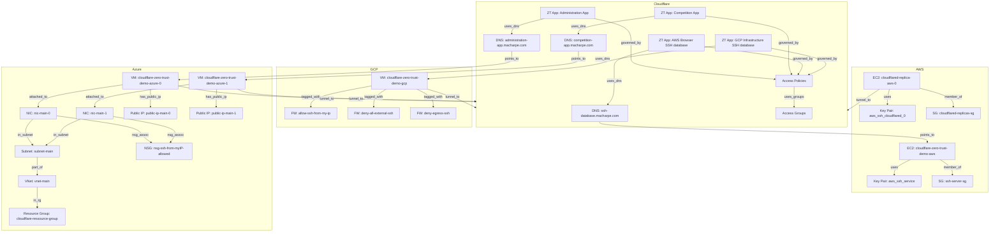

```mermaid
flowchart TD
  %% AWS
  subgraph AWS
    aws_instance_db["EC2: cloudflare-zero-trust-demo-aws"]
    aws_instance_cloudflared["EC2: cloudflared-replica-aws-0"]
    aws_keypair_cloudflared["Key Pair: aws_ssh_cloudflared_0"]
    aws_keypair_service["Key Pair: aws_ssh_service"]
    aws_sg_cloudflared["SG: cloudflared-replicas-sg"]
    aws_sg_ssh["SG: ssh-server-sg"]
  end

  %% Azure
  subgraph Azure
    azure_rg["Resource Group: cloudflare-ressource-group"]
    azure_vnet["VNet: vnet-main"]
    azure_subnet["Subnet: subnet-main"]
    azure_nsg["NSG: nsg-ssh-from-myIP-allowed"]
    azure_nic0["NIC: nic-main-0"]
    azure_nic1["NIC: nic-main-1"]
    azure_vm0["VM: cloudflare-zero-trust-demo-azure-0"]
    azure_vm1["VM: cloudflare-zero-trust-demo-azure-1"]
    azure_pip0["Public IP: public-ip-main-0"]
    azure_pip1["Public IP: public-ip-main-1"]
  end

  %% GCP
  subgraph GCP
    gcp_vm["VM: cloudflare-zero-trust-demo-gcp"]
    gcp_fw_allow["FW: allow-ssh-from-my-ip"]
    gcp_fw_deny["FW: deny-all-external-ssh"]
    gcp_fw_deny_egress["FW: deny-egress-ssh"]
  end

  %% Cloudflare
  subgraph Cloudflare
    cf_dns_ssh["DNS: ssh-database.macharpe.com"]
    cf_dns_web["DNS: administration-app.macharpe.com"]
    cf_dns_web_sensitive["DNS: competition-app.macharpe.com"]
    cf_app_admin["ZT App: Administration App"]
    cf_app_sensitive["ZT App: Competition App"]
    cf_app_ssh_aws["ZT App: AWS Browser SSH database"]
    cf_app_ssh_gcp["ZT App: GCP Infrastructure SSH database"]
    cf_access_groups["Access Groups"]
    cf_access_policies["Access Policies"]
  end

  %% AWS Connections
  aws_instance_db -- uses --> aws_keypair_service
  aws_instance_cloudflared -- uses --> aws_keypair_cloudflared
  aws_instance_db -- member_of --> aws_sg_ssh
  aws_instance_cloudflared -- member_of --> aws_sg_cloudflared

  %% Azure Connections
  azure_vm0 -- attached_to --> azure_nic0
  azure_vm1 -- attached_to --> azure_nic1
  azure_nic0 -- in_subnet --> azure_subnet
  azure_nic1 -- in_subnet --> azure_subnet
  azure_subnet -- part_of --> azure_vnet
  azure_vnet -- in_rg --> azure_rg
  azure_vm0 -- has_public_ip --> azure_pip0
  azure_vm1 -- has_public_ip --> azure_pip1
  azure_nic0 -- nsg_assoc --> azure_nsg
  azure_nic1 -- nsg_assoc --> azure_nsg

  %% GCP Connections
  gcp_vm -- tagged_with --> gcp_fw_allow
  gcp_vm -- tagged_with --> gcp_fw_deny
  gcp_vm -- tagged_with --> gcp_fw_deny_egress

  %% Cloudflare Connections
  cf_dns_ssh -- points_to --> aws_instance_db
  cf_dns_web -- points_to --> azure_vm0
  cf_dns_web_sensitive -- points_to --> azure_vm1
  cf_app_admin -- uses_dns --> cf_dns_web
  cf_app_sensitive -- uses_dns --> cf_dns_web_sensitive
  cf_app_ssh_aws -- uses_dns --> cf_dns_ssh
  cf_app_ssh_gcp -- uses_dns --> gcp_vm
  cf_app_admin -- governed_by --> cf_access_policies
  cf_app_sensitive -- governed_by --> cf_access_policies
  cf_app_ssh_aws -- governed_by --> cf_access_policies
  cf_app_ssh_gcp -- governed_by --> cf_access_policies
  cf_access_policies -- uses_groups --> cf_access_groups

  %% Cross-cloud tunnels
  aws_instance_cloudflared -- tunnel_to --> Cloudflare
  azure_vm0 -- tunnel_to --> Cloudflare
  azure_vm1 -- tunnel_to --> Cloudflare
  gcp_vm -- tunnel_to --> Cloudflare
```
