# Terraform Cloudflare Zero Trust Demo - Comprehensive Architecture

```mermaid
flowchart TB
  %% External Services
  subgraph External ["External Services"]
    Okta["Okta SAML IdP"]
    Internet["Internet"]
    MyIP["My IP Address"]
  end

  %% Azure AD
  subgraph AzureAD ["Azure Active Directory"]
    direction TB
    AzureADGroups["AD Groups<br/>• Engineering<br/>• Sales"]
    AzureADUsers["AD Users<br/>• developer1/2<br/>• sales1/2"]
    AzureADGroups --> AzureADUsers
  end

  %% AWS Infrastructure
  subgraph AWS ["Amazon Web Services"]
    direction TB
    subgraph AWSNetwork ["Network Infrastructure"]
      aws_vpc["VPC: aws_custom_vpc"]
      aws_igw["Internet Gateway: igw"]
      aws_public_subnet["Public Subnet"]
      aws_private_subnet["Private Subnet"]
      aws_nat_eip["Elastic IP: nat_eip"]
      aws_nat["NAT Gateway: nat"]
      aws_public_rt["Route Table: public_rt"]
      aws_private_rt["Route Table: private_rt"]
      
      aws_vpc --> aws_public_subnet
      aws_vpc --> aws_private_subnet
      aws_igw --> aws_public_rt
      aws_nat_eip --> aws_nat
      aws_nat --> aws_private_rt
      aws_public_subnet --> aws_public_rt
      aws_private_subnet --> aws_private_rt
    end
    
    subgraph AWSCompute ["Compute Resources"]
      aws_ssh_instance["EC2: SSH Service<br/>aws_ec2_service_instance"]
      aws_vnc_instance["EC2: VNC Service<br/>aws_ec2_vnc_instance"]
      aws_cloudflared_instances["EC2: Cloudflared Replicas<br/>cloudflared_aws[count]"]
    end
    
    subgraph AWSSecurity ["Security"]
      aws_ssh_sg["SG: aws_ssh_server_sg"]
      aws_vnc_sg["SG: aws_vnc_server_sg"]
      aws_cloudflared_sg["SG: aws_cloudflared_sg"]
      aws_ssh_key["Key: aws_ec2_service_key_pair"]
      aws_vnc_key["Key: aws_ec2_vnc_key_pair"]
      aws_cloudflared_keys["Keys: aws_ec2_cloudflared_key_pair[count]"]
    end
    
    aws_ssh_instance --> aws_ssh_sg
    aws_vnc_instance --> aws_vnc_sg
    aws_cloudflared_instances --> aws_cloudflared_sg
    aws_ssh_instance --> aws_ssh_key
    aws_vnc_instance --> aws_vnc_key
    aws_cloudflared_instances --> aws_cloudflared_keys
  end

  %% GCP Infrastructure
  subgraph GCP ["Google Cloud Platform"]
    direction TB
    subgraph GCPNetwork ["Network Infrastructure"]
      gcp_vpc["VPC: zero-trust-vpc"]
      gcp_cloudflared_subnet["Subnet: gcp_cloudflared_subnet"]
      gcp_warp_subnet["Subnet: gcp_warp_subnet"]
      gcp_rdp_subnet["Subnet: gcp_cloudflared_windows_rdp_subnet"]
      gcp_router["Cloud Router: cloud_router"]
      gcp_nat_ip["Static IP: cloud_nat_ip"]
      gcp_nat["Cloud NAT: cloud_nat"]
      gcp_default_route["Route: default_route"]
      
      gcp_vpc --> gcp_cloudflared_subnet
      gcp_vpc --> gcp_warp_subnet
      gcp_vpc --> gcp_rdp_subnet
      gcp_router --> gcp_nat
      gcp_nat_ip --> gcp_nat
      gcp_default_route --> gcp_vpc
    end
    
    subgraph GCPCompute ["Compute Resources"]
      gcp_infra_vm["VM: Infrastructure Access<br/>gcp_cloudflared_vm_instance"]
      gcp_windows_vm["VM: Windows RDP Server<br/>gcp_windows_rdp_server"]
      gcp_warp_vms["VMs: WARP Connector<br/>gcp_vm_instance[count]"]
    end
    
    subgraph GCPSecurity ["Security & Firewall"]
      gcp_fw_ssh_allow["FW: allow_ssh_from_my_ip"]
      gcp_fw_icmp["FW: allow_icmp_from_any"]
      gcp_fw_ssh_deny["FW: default_ssh_deny"]
      gcp_fw_egress_deny["FW: deny_egress_ssh"]
      gcp_fw_egress_allow["FW: allow_egress"]
      gcp_fw_rdp["FW: allow_rdp_from_my-ip"]
    end
    
    subgraph GCPRouting ["WARP Routing"]
      gcp_route_warp["Route: route_to_warp_subnet"]
      gcp_route_azure["Route: route_to_azure_subnet"]
      gcp_route_aws["Route: route_to_aws_subnet"]
    end
    
    gcp_infra_vm --> gcp_cloudflared_subnet
    gcp_windows_vm --> gcp_rdp_subnet
    gcp_warp_vms --> gcp_warp_subnet
  end

  %% Azure Infrastructure
  subgraph Azure ["Microsoft Azure"]
    direction TB
    subgraph AzureNetwork ["Network Infrastructure"]
      azure_rg["Resource Group: cloudflare_rg"]
      azure_vnet["VNet: cloudflare_vnet"]
      azure_subnet["Subnet: cloudflare_subnet"]
      azure_nat_pip["Public IP: nat_gateway_public_ip"]
      azure_nat_gw["NAT Gateway: cloudflare_natgw"]
      azure_route_table["Route Table: cloudflare_route_table_warp"]
      azure_public_ips["Public IPs: public_ip[count]"]
      azure_nsg["NSG: nsg"]
      
      azure_rg --> azure_vnet
      azure_vnet --> azure_subnet
      azure_nat_pip --> azure_nat_gw
      azure_route_table --> azure_subnet
      azure_nsg --> azure_subnet
    end
    
    subgraph AzureCompute ["Compute Resources"]
      azure_vms["VMs: Linux WARP Connector<br/>cloudflare_zero_trust_demo_azure[count]"]
      azure_nics["NICs: nic[count]<br/>(First with IP forwarding)"]
    end
    
    subgraph AzureRouting ["WARP Routing"]
      azure_route_warp["Route: To WARP Subnet"]
      azure_route_gcp["Route: To GCP Subnet"]
      azure_route_aws["Route: To AWS Subnet"]
    end
    
    azure_vms --> azure_nics
    azure_nics --> azure_subnet
    azure_public_ips --> azure_nics
  end

  %% Cloudflare Zero Trust
  subgraph Cloudflare ["Cloudflare Zero Trust"]
    direction TB
    subgraph CFTunnels ["Cloudflare Tunnels"]
      cf_gcp_tunnel["Tunnel: gcp_cloudflared_tunnel"]
      cf_gcp_rdp_tunnel["Tunnel: gcp_cloudflared_windows_rdp_tunnel"]
      cf_aws_tunnel["Tunnel: aws_cloudflared_tunnel"]
      cf_tunnel_routes["Private Network Routes<br/>• GCP Infrastructure<br/>• GCP Windows RDP"]
    end
    
    subgraph CFDNS ["DNS Records"]
      cf_dns_web["DNS: web.domain.com"]
      cf_dns_web_sensitive["DNS: web-sensitive.domain.com"]
      cf_dns_ssh["DNS: ssh-database.domain.com"]
      cf_dns_vnc["DNS: vnc.domain.com"]
    end
    
    subgraph CFApps ["Access Applications"]
      cf_app_admin["App: Administration Web App"]
      cf_app_sensitive["App: Sensitive Web Server"]
      cf_app_ssh_gcp["App: GCP Infrastructure SSH"]
      cf_app_ssh_aws["App: AWS Browser SSH"]
      cf_app_vnc_aws["App: AWS Browser VNC"]
    end
    
    subgraph CFPolicies ["Access Policies & Groups"]
      cf_rule_groups["Rule Groups<br/>• Contractors<br/>• Infrastructure Admins<br/>• Sales Engineering<br/>• Sales<br/>• IT Admins"]
      cf_access_policies["Access Policies<br/>• Group-based access<br/>• Device posture<br/>• MFA requirements<br/>• Purpose justification"]
      cf_gateway_policies["Gateway Policies<br/>• RDP Admin Access<br/>• Content Filtering<br/>• IP Restrictions"]
    end
    
    subgraph CFDevice ["Device Management"]
      cf_device_profiles["Device Profiles<br/>• Default Profile<br/>• Split Tunnel Config<br/>• Contractor/Employee"]
      cf_warp_connectors["WARP Connectors<br/>• Azure Token<br/>• GCP Token<br/>• Route Advertisement"]
    end
    
    subgraph CFAuth ["Authentication"]
      cf_short_certs["Short-Lived Certificates<br/>SSH CA for Infrastructure"]
      cf_access_tags["Access Tags<br/>zero_trust_demo_tag"]
    end
  end

  %% Key Management Module
  subgraph KeyMgmt ["SSH Key Management"]
    direction TB
    gcp_user_keys["GCP User Keys<br/>gcp_user_keys[for_each]"]
    gcp_vm_keys["GCP VM Keys<br/>gcp_vm_key[count]"]
    azure_keys["Azure Keys<br/>azure_ssh_key[count]"]
    key_storage["Key Storage<br/>modules/keys/out/"]
    
    gcp_user_keys --> key_storage
    gcp_vm_keys --> key_storage
    azure_keys --> key_storage
  end

  %% WARP Routing Module
  subgraph WARPRouting ["WARP Routing Calculation"]
    direction TB
    python_azure["Python Script<br/>Azure Infrastructure"]
    python_gcp["Python Script<br/>GCP Infrastructure WARP"]
    python_aws["Python Script<br/>AWS Infrastructure"]
    json_outputs["JSON Outputs<br/>• Azure subnets<br/>• GCP subnets<br/>• AWS subnets"]
    
    python_azure --> json_outputs
    python_gcp --> json_outputs
    python_aws --> json_outputs
  end

  %% Utility Resources
  subgraph Utilities ["Utility & Cleanup"]
    direction TB
    cleanup_hosts["Cleanup: known_hosts"]
    cleanup_devices["Cleanup: CF devices"]
    macos_posture["macOS Posture Updates"]
  end

  %% Cross-Service Connections
  Okta --> Cloudflare
  AzureAD --> Cloudflare
  MyIP --> AWS
  MyIP --> GCP
  MyIP --> Azure
  
  %% Tunnel Connections
  aws_cloudflared_instances -.-> cf_aws_tunnel
  gcp_infra_vm -.-> cf_gcp_tunnel
  gcp_windows_vm -.-> cf_gcp_rdp_tunnel
  azure_vms -.-> Cloudflare
  
  %% DNS to Service Mappings
  cf_dns_web --> cf_app_admin
  cf_dns_web_sensitive --> cf_app_sensitive
  cf_dns_ssh --> cf_app_ssh_aws
  cf_dns_vnc --> cf_app_vnc_aws
  
  %% Access Control Flow
  cf_access_policies --> cf_app_admin
  cf_access_policies --> cf_app_sensitive
  cf_access_policies --> cf_app_ssh_gcp
  cf_access_policies --> cf_app_ssh_aws
  cf_access_policies --> cf_app_vnc_aws
  cf_rule_groups --> cf_access_policies
  
  %% WARP Connector Cross-Cloud Routing
  azure_vms -.-> gcp_warp_vms
  azure_vms -.-> aws_cloudflared_instances
  gcp_warp_vms -.-> azure_vms
  gcp_warp_vms -.-> aws_cloudflared_instances
  
  %% Module Dependencies
  WARPRouting --> CFDevice
  KeyMgmt --> AWS
  KeyMgmt --> GCP
  KeyMgmt --> Azure

  %% Styling
  classDef awsStyle fill:#ff9900,stroke:#000000,stroke-width:2px,color:#000000
  classDef gcpStyle fill:#4285f4,stroke:#000000,stroke-width:2px,color:#ffffff
  classDef azureStyle fill:#0078d4,stroke:#000000,stroke-width:2px,color:#ffffff
  classDef cloudflareStyle fill:#f38020,stroke:#000000,stroke-width:2px,color:#000000
  classDef externalStyle fill:#e0e0e0,stroke:#000000,stroke-width:2px,color:#000000
  classDef moduleStyle fill:#90EE90,stroke:#000000,stroke-width:2px,color:#000000
  
  class AWS,AWSNetwork,AWSCompute,AWSSecurity awsStyle
  class GCP,GCPNetwork,GCPCompute,GCPSecurity,GCPRouting gcpStyle
  class Azure,AzureNetwork,AzureCompute,AzureRouting azureStyle
  class Cloudflare,CFTunnels,CFDNS,CFApps,CFPolicies,CFDevice,CFAuth cloudflareStyle
  class External,AzureAD,Utilities externalStyle
  class KeyMgmt,WARPRouting moduleStyle
```

## Architecture Overview

This comprehensive diagram represents a multi-cloud Zero Trust architecture using Cloudflare Zero Trust to secure access across AWS, GCP, and Azure environments. Key components include:

### **Multi-Cloud Infrastructure**
- **AWS**: SSH/VNC browser-rendered services with cloudflared replicas
- **GCP**: Infrastructure access VMs, Windows RDP server, and WARP connectors
- **Azure**: Linux VMs with WARP connector functionality

### **Zero Trust Security**
- **Identity Integration**: Okta SAML and Azure AD integration
- **Access Control**: Group-based policies with device posture and MFA
- **Network Security**: Cloudflare Tunnels for secure private network access
- **Content Filtering**: Gateway policies for web filtering and IP restrictions

### **Cross-Cloud Connectivity**
- **WARP Connectors**: Enable secure communication between cloud environments
- **Dynamic Routing**: Python scripts calculate optimal subnet routing
- **Private Networks**: Cloudflare Tunnels expose private resources securely

### **Key Features**
- **Device Management**: Profiles for contractors vs employees with different access levels
- **Certificate Authority**: Short-lived SSH certificates for infrastructure access
- **Automated Cleanup**: Scripts for maintaining SSH known_hosts and device registrations
- **Posture Checking**: macOS version compliance for device access
