# High-Level Architecture - Cloudflare Zero Trust Multi-Cloud Demo

## Simple Overview

This ultra-simplified diagram shows the core architecture with just the essential components:

```mermaid
flowchart LR
    Users["👥 Users"]
    IDP["🔐 Identity Provider<br/>Okta/Azure AD"]  
    Cloudflare["☁️ Cloudflare<br/>Zero Trust"]
    Apps["📱 Applications<br/>AWS/GCP/Azure"]
    
    Users --> IDP
    IDP --> Cloudflare
    Cloudflare --> Apps
    
    classDef userStyle fill:#e1f5fe,stroke:#01579b,stroke-width:2px
    classDef idpStyle fill:#f3e5f5,stroke:#4a148c,stroke-width:2px
    classDef cfStyle fill:#fff3e0,stroke:#e65100,stroke-width:3px
    classDef appStyle fill:#e8f5e8,stroke:#1b5e20,stroke-width:2px
    
    class Users userStyle
    class IDP idpStyle
    class Cloudflare cfStyle
    class Apps appStyle
```

## Detailed Architecture

This more comprehensive diagram shows the high-level architecture of the multi-cloud Zero Trust solution, focusing on the key components and data flows without implementation details.

```mermaid
flowchart TB
    %% Users and Identity
    subgraph Users ["👥 Users & Identity"]
        direction TB
        EndUsers["🧑‍💻 End Users<br/>• DevOps Engineers<br/>• Sales Team<br/>• Contractors"]
        Devices["💻 Devices<br/>• macOS/Windows<br/>• WARP Client<br/>• Device Posture"]
    end

    %% Identity Providers
    subgraph IdP ["🔐 Identity Providers"]
        direction TB
        Okta["Okta SAML<br/>• SAML Groups<br/>• MFA Required"]
        AzureAD["Azure AD<br/>• Group-based Access<br/>• SSO Integration"]
    end

    %% Cloudflare Zero Trust Core
    subgraph CF ["☁️ Cloudflare Zero Trust"]
        direction TB
        
        subgraph CFCore ["Core Services"]
            Access["🛡️ Zero Trust Access<br/>• Policy Enforcement<br/>• App Launcher<br/>• Short-lived Certs"]
            Gateway["🚪 Secure Web Gateway<br/>• DNS Filtering<br/>• Firewall Rules<br/>• Lateral Movement Prevention"]
            WARP["🔗 WARP<br/>• Device Client<br/>• Private Network Access<br/>• Site-to-Site Connectivity"]
        end
        
        subgraph CFTunnels ["Tunnels & Connectivity"]
            Tunnels["🚇 Cloudflare Tunnels<br/>• Private Network Exposure<br/>• No Inbound Firewall Rules<br/>• Encrypted Connections"]
        end
    end

    %% Multi-Cloud Infrastructure
    subgraph MultiCloud ["🌐 Multi-Cloud Infrastructure"]
        direction LR
        
        subgraph AWS ["☁️ AWS (us-east-1)"]
            AWSApps["📱 Applications<br/>• Browser SSH/VNC<br/>• Database Access<br/>• EC2 Instances"]
        end
        
        subgraph GCP ["☁️ GCP (europe-west3)"]
            GCPApps["📱 Applications<br/>• Infrastructure Access<br/>• Windows RDP<br/>• Web Applications<br/>• WARP Connectors"]
        end
        
        subgraph Azure ["☁️ Azure (westeurope)"]
            AzureApps["📱 Applications<br/>• Linux VMs<br/>• WARP Connectors<br/>• Cross-cloud Routing"]
        end
    end

    %% Monitoring & DevOps
    subgraph Monitoring ["📊 Monitoring & DevOps"]
        direction TB
        Datadog["📈 Datadog<br/>• Multi-cloud Monitoring<br/>• Process Monitoring<br/>• Performance Metrics"]
        Terraform["🏗️ Infrastructure as Code<br/>• Terraform<br/>• GitHub Actions<br/>• Automated Deployment"]
    end

    %% Application Categories
    subgraph Apps ["🎯 Application Types"]
        direction TB
        WebApps["🌐 Web Applications<br/>• Intranet Portal<br/>• Competition Platform<br/>• Self-hosted Apps"]
        InfraApps["🔧 Infrastructure Apps<br/>• SSH Access<br/>• RDP Access<br/>• Database Connections"]
        BrowserApps["🖥️ Browser-Rendered<br/>• Remote Desktop<br/>• Terminal Access<br/>• GUI Applications"]
    end

    %% Connections - Users to Identity
    EndUsers --> Devices
    Devices --> Okta
    Devices --> AzureAD

    %% Identity to Cloudflare
    Okta --> Access
    AzureAD --> Access

    %% Cloudflare Core Interactions
    Access <--> Gateway
    Access <--> WARP
    Gateway <--> WARP
    Tunnels <--> Access

    %% Device to WARP
    Devices -.-> WARP

    %% Cloudflare to Multi-Cloud
    Tunnels -.-> AWS
    Tunnels -.-> GCP
    Tunnels -.-> Azure
    WARP -.-> AWS
    WARP -.-> GCP
    WARP -.-> Azure

    %% Inter-cloud Connectivity
    AWS <-.-> GCP
    GCP <-.-> Azure
    Azure <-.-> AWS

    %% Applications served from clouds
    AWS --> WebApps
    GCP --> WebApps
    AWS --> InfraApps
    GCP --> InfraApps
    AWS --> BrowserApps
    GCP --> BrowserApps

    %% Monitoring connections
    Monitoring --> AWS
    Monitoring --> GCP
    Monitoring --> Azure
    Monitoring --> CF

    %% Styling
    classDef userStyle fill:#e1f5fe,stroke:#01579b,stroke-width:2px,color:#000000
    classDef identityStyle fill:#f3e5f5,stroke:#4a148c,stroke-width:2px,color:#000000
    classDef cloudflareStyle fill:#fff3e0,stroke:#e65100,stroke-width:3px,color:#000000
    classDef awsStyle fill:#fff8e1,stroke:#ff6f00,stroke-width:2px,color:#000000
    classDef gcpStyle fill:#e8f5e8,stroke:#1b5e20,stroke-width:2px,color:#000000
    classDef azureStyle fill:#e3f2fd,stroke:#0d47a1,stroke-width:2px,color:#000000
    classDef appStyle fill:#fce4ec,stroke:#880e4f,stroke-width:2px,color:#000000
    classDef monitoringStyle fill:#f1f8e9,stroke:#33691e,stroke-width:2px,color:#000000

    class Users,Devices,EndUsers userStyle
    class IdP,Okta,AzureAD identityStyle
    class CF,CFCore,CFTunnels,Access,Gateway,WARP,Tunnels cloudflareStyle
    class AWS,AWSApps awsStyle
    class GCP,GCPApps gcpStyle
    class Azure,AzureApps azureStyle
    class Apps,WebApps,InfraApps,BrowserApps appStyle
    class Monitoring,Datadog,Terraform monitoringStyle
```

## Key Architecture Principles

### 🛡️ **Zero Trust Security**
- **Never Trust, Always Verify**: Every connection is authenticated and authorized
- **Principle of Least Privilege**: Users get minimal required access
- **Device-Centric Security**: Device posture checking before access

### 🌐 **Multi-Cloud Strategy**
- **AWS**: Browser-rendered services (SSH, VNC, databases)
- **GCP**: Infrastructure access, web applications, Windows services
- **Azure**: Linux VMs with cross-cloud WARP connectivity
- **Seamless Integration**: WARP connectors enable secure inter-cloud communication

### 🔐 **Identity-First Approach**
- **Unified Authentication**: Okta SAML and Azure AD integration
- **Group-Based Access**: Role-based permissions (Sales, Engineering, IT, Contractors)
- **MFA Enforcement**: Multi-factor authentication required for all access

### 🚇 **Private Network Access**
- **Cloudflare Tunnels**: Secure private network exposure without VPNs
- **WARP Client**: Zero Trust network access from any device
- **No Inbound Rules**: Applications remain private with outbound-only connections

### 📊 **Observability & Automation**
- **Centralized Monitoring**: Datadog across all cloud providers
- **Infrastructure as Code**: Terraform-managed deployment
- **Automated Workflows**: GitHub Actions for CI/CD

## Benefits of This Architecture

1. **🔒 Enhanced Security**: Zero Trust model with comprehensive policy enforcement
2. **🌍 Global Scale**: Multi-cloud deployment across different regions
3. **👥 User Experience**: Single sign-on with app launcher for easy access
4. **🔧 DevOps Friendly**: Infrastructure as Code with automated monitoring
5. **💰 Cost Effective**: Pay-per-use model with optimized resource utilization
6. **🚀 Future-Proof**: Scalable architecture supporting growth and new use cases

---
*This high-level diagram abstracts the complex implementation details while highlighting the core architectural patterns and data flows of the Zero Trust multi-cloud solution.*